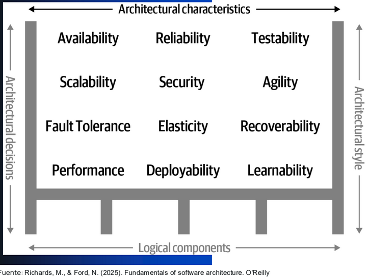
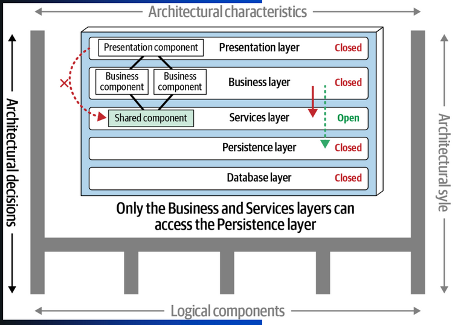
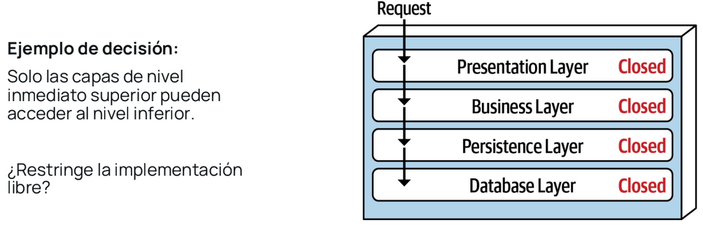
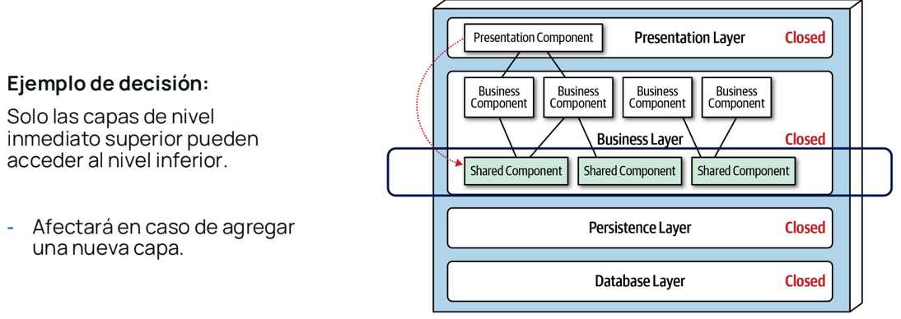
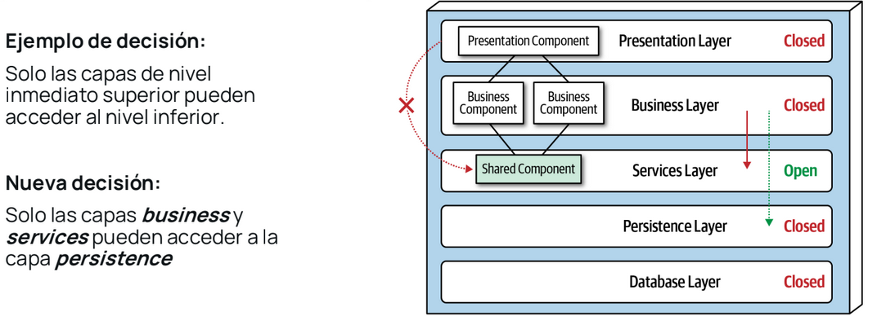
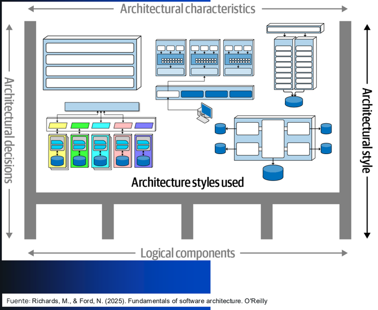
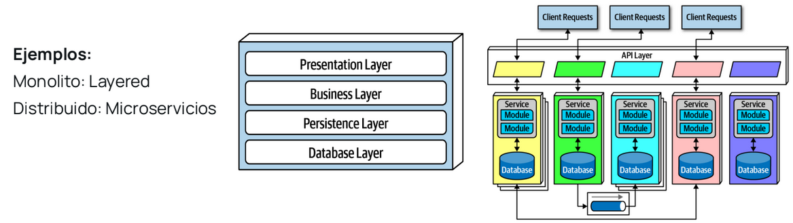

# Introduccion a la arquitectura de software  

## Dimensiones de arquitectura de software 
La arquitectura de software es el diseño estrcutural de un ssitema, cmo un plano maestro que define sus componentes, como interactuan entre si y como se organizan para cumplir requisitos funcionales y no funcionales

El software (codigo) es de naturaleza caotica
- El codigo tiende al caos
- Ausencia de una estrcutura perceptible
- Gran bola de barro "Big ball of mud" (jungla de codigos extensos y desordenados)

"El caos (software) requiere de la aplicacion de energia en un esfuerzo consciente para ser estabilizado"

### Dimensiones de arquitectura de software 
#### D1. Caracteristicas
Esta dimension describe aquellos aspectos del sistema que deben ser soportados por la arquitectura Ejemplos:scalability, testability, availability, etc.

Las caracteristicas conforman el fundamento sobre cl cual se realiza el analisis para el diseño de la solucion (arquitectura)

Fuertemente relacionados con la definicion de requerimiento "no-funcional"

Ejercicio: 
**Identifica  las carcateristicas de arquitectura**
- Cambiar el tamaño de fuente en la interfaz de usuario
Usabilidad, por que tiene que ver con la facilidad de uso del sistema y la accesibilidad para el usuario final, por ejemplo, personas con problemas de vision

- Instalación de nueva versión en tiempo mínimo
Deployability (desplegabilidad) y Availability (disponibilidad)
El sistema debe actualizarse rapidamente sin afectar a los usuarios ni provocar tiempos largos de inactividad

- Gestionar miles de usuarios simultáneos
Scalability (Escalabilidad) y Elasticity (Elasticidad)
Por que debe soportar muchos usuatios al mismo tiempo y daptarse automaticamente a picos de demanda

- Cifrar las contraseñas de los usuarios almacenadas en la base de datos
Security (Seguridad)
Proteccion a datos personales

- Interactuar con muchos sistemas externos para completar una solicitud comercial
Interoperability (Interoperabilidad) 
El sistema debe comunicarse correctamente con otros sistemas, APIs o servicios externos 

#### D2. Decisiones
Son elecciones que se hacen sobre aspectos estructurales del sistema que tiene implicaciones significativas a lo largo del plazo.

Estas desiciones de arquitectura:
- Definen las reglas respecto dde como un sistema debe ser construido
- Dirigen al equipo de desarrollo respecto de lo que esta y no esta permitido

- Son reglas de cumplimiento obligatorio
- Constantemente en observacion
- Permite contar con una relacion de consistencia respecto de la implementacion tecnica en todos los niveles del sistema

- Estas desiciones pueden cambiar con el tiempo, con la justificacion tecnica adecuada
- Permite contar con un criterio de control para la evolucion de software, particularmente asocuado a la entropia del codigo base
  

#### D3. Estilo/ Arquitectura
Es el estilo arquitectonico adoptado para el sistema, este define la forma y estrcutura general del software 

- Representa la idea abstracta de organizacion de funcionalidad
- Orienta a la organizacion de codigo (no a la implementacion)

#### D4. Componentes logicos
- Las características defines las capacidades del software, mientras que los componente lógico definen el comportamiento.

- El diseño de componente lógicos es una de las actividades rectoras clave de un arquitecto.
- Los componentes lógicos defines: dominios, entidades, flujos de trabajo/comunicación

---

***Importante***: Todas las dimensiones deben ser tomadas en cuenta al diseñar o al analizar la arquitectura

### Leyes de arquitectura de software 
1. Todo en la arquitectura de software es un compensacion 
2. El por que es mucho mas importante que el como
