# Pensamiento arquitectonico  el rol del arquitecto de software 

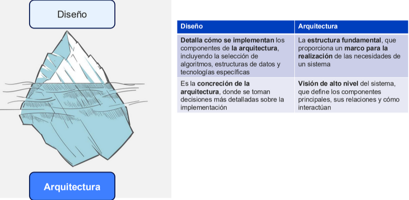

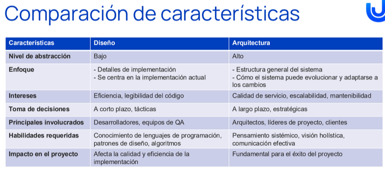

Relacion entre arquitectura y disenio
- La arquitectura proporciona el marco para el disenio
- El disenio detalla la implementacion de la arquitectura
- Ambos son interdependientes y se influyen mutuamente

## Perspectiva secuencial (tradicional)
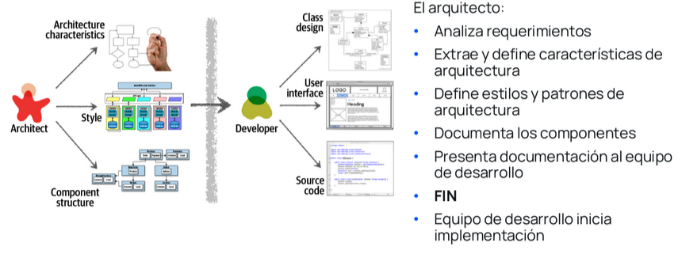

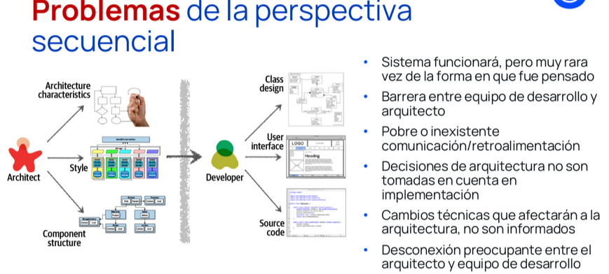

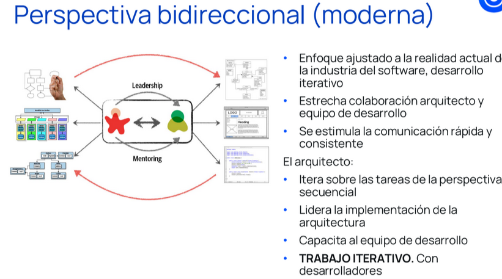

Tanto el disenio y la arquitectura son interdependientes, ambos requieren retroalimentacion constante de ambos lados 

## Exprectativa del Rol del arquitecto
- Tomar desiciones arquitectonicas
  
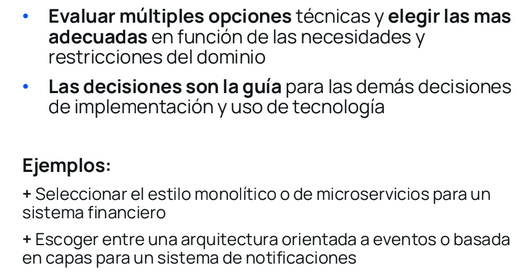

- Analizar continuamente la arquitectura

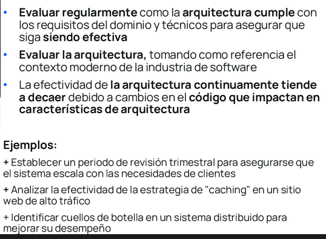

- Estar actualizado con las tendencias
  
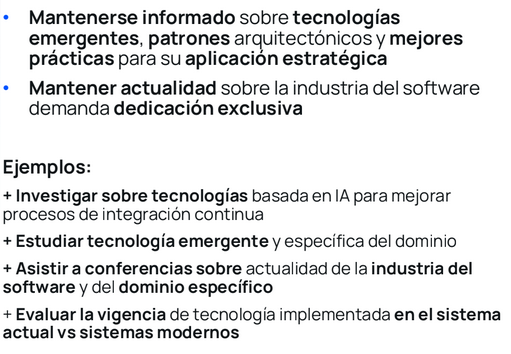

- Asegurar el cumplimiento de desiciones
  
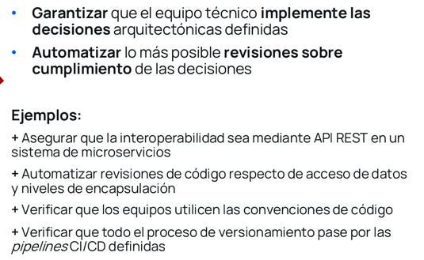

- Poseer experiencia y exposicion diversa
  
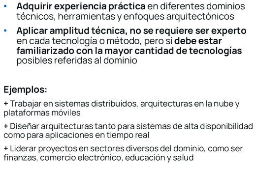

- Tener conocimiento del dominio del negocio
  
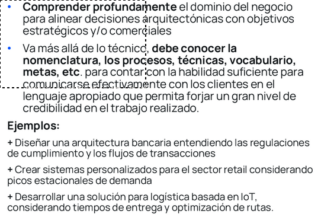

- Poseer habilidades interpersonales

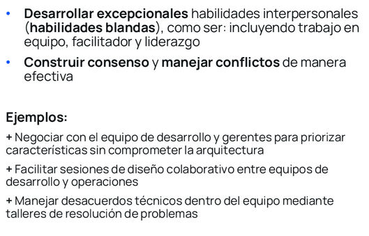

- Comprender y navegar la politica organizacional

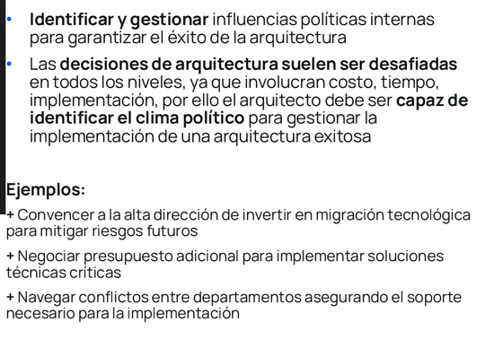

